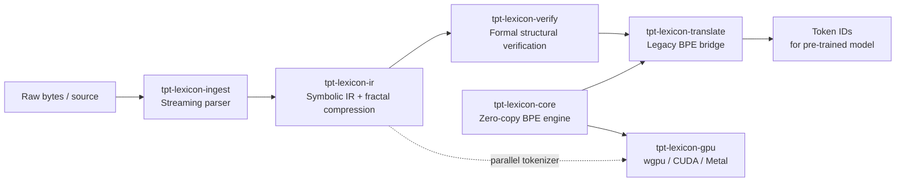

# TPT Lexicon

A neuro-symbolic preprocessing & translation suite for LLM inference pipelines: parallel/zero-copy tokenization, a symbolic IR with fractal compression, formal verification of IR edits, and a translation bridge to legacy BPE tokenizers — so existing pre-trained models can benefit without retraining.

See [`spec.txt`](spec.txt) for the full design document and [`todo.md`](todo.md) for implementation progress.

Status: **pre-alpha** — implementation in progress. No crate is published yet.

## Quickstart

```rust
use tpt_lexicon_core::{BpeTokenizer, Vocab};

// Train a BPE vocabulary from a byte corpus.
let vocab = Vocab::train(b"hello world hello world hello", 20).unwrap();
let tok = BpeTokenizer::new(&vocab);

// Zero-copy tokenization — tokens borrow directly from the input.
let tokens = tok.encode(b"hello world");
assert_eq!(tokens.as_bytes(), b"hello world"); // lossless round-trip
```

See the [`examples/`](examples/) directory for runnable end-to-end demos:

| Example | What it shows |
|---|---|
| `cargo run --example quickstart` | Train → tokenize → decode |
| `cargo run --example pipeline` | Ingest → IR → compress → verify → translate |
| `cargo run --example hf_import` | Load HuggingFace `tokenizer.json` → translate |
| `cargo run -p tpt-lexicon-cli <file>` | CLI pipeline tool (stdin or file) |

For a ready-to-use project skeleton, see the [`templates/starter/`](templates/starter/) directory.

## Architecture



## Crates

| Crate | Role | `no_std` |
|---|---|---|
| [`tpt-lexicon-core`](crates/tpt-lexicon-core) | Zero-copy tokenizer engine (parallel prefix-sum BPE, SRAM-native vocab mapping) | yes |
| [`tpt-lexicon-ingest`](crates/tpt-lexicon-ingest) | Streaming, syntax-aware parser (code, Markdown, JSON, NL) | yes |
| [`tpt-lexicon-ir`](crates/tpt-lexicon-ir) | Symbolic IR with fractal/recursive compression | yes |
| [`tpt-lexicon-verify`](crates/tpt-lexicon-verify) | Formal verification of IR edits and outputs | yes |
| [`tpt-lexicon-translate`](crates/tpt-lexicon-translate) | Legacy BPE bridge + cross-IR translation (Tree-sitter, LSP, LLVM IR) | yes |
| [`tpt-lexicon-gpu`](crates/tpt-lexicon-gpu) | Optional wgpu/CUDA/Metal acceleration | no (feature-gated, opt-in) |
| [`tpt-lexicon-cli`](crates/tpt-lexicon-cli) | CLI pipeline tool: ingest → IR → verify → translate | n/a (binary) |

Each crate is independently usable — `tpt-lexicon-core` has no dependency on the rest of the workspace, and `tpt-lexicon-gpu` is entirely optional.

## Design goals

| Goal | Outcome |
|---|---|
| 1000× tokenization speedup | Sub-millisecond tokenization of 100K-token inputs |
| Zero-copy, `no_std` core | Caller-supplied buffers only; no stdlib required |
| Logarithmic context compression | O(log N) context usage via fractal IR compression |
| Universal legacy interoperability | 100% compatibility with HuggingFace/BPE tokenizers via the Translation Bridge |
| 100% structural validity | Output IR passes formal verification before rendering to text |
| Composable crate surface | Each crate usable independently; no forced coupling |

## Building

```sh
cargo build --workspace
cargo test --workspace
cargo clippy --workspace --all-targets -- -D warnings
cargo fmt --all -- --check
```

## License

Licensed under either of [Apache License, Version 2.0](LICENSE-APACHE) or
[MIT license](LICENSE-MIT) at your option.
